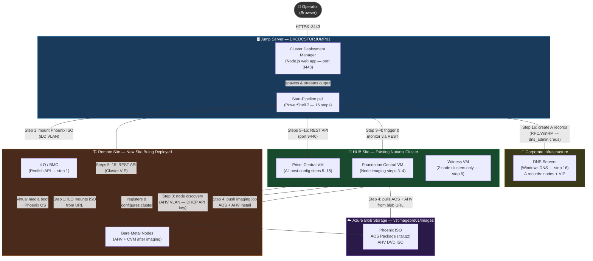
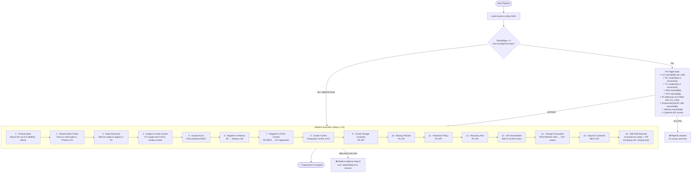

# Nutanix ZTI — Zero-Touch Infrastructure Pipeline

## 📋 Table of Contents
- [Overview](#overview)
- [Architecture](#architecture)
- [Prerequisites](#prerequisites)
  - [1. Network Infrastructure](#1-network-infrastructure-switch--physical)
  - [2. DHCP and IP Planning](#2-dhcp-and-ip-planning)
  - [3. Foundation Central API Key in DHCP Vendor Options](#3-foundation-central-api-key-in-dhcp-vendor-options)
  - [4. Prism Central](#4-prism-central--already-installed-and-running)
  - [5. Witness VM](#5-witness-vm)
  - [6. Software Image Files](#6-software-image-files)
  - [7. CyberArk](#7-cyberark-step-15)
  - [8. Jump Server PowerShell Environment](#8-jump-server-powershell-environment)
  - [9. Network Reachability from PC/FC to Remote Site](#9-network-reachability-from-prism-central--foundation-central-to-remote-site)
  - [10. Custom Phoenix Image — Per Region](#10-custom-phoenix-image--per-region-requirement)
  - [11. DNS Service Account (Step 16)](#11-dns-service-account-step-16)
- [Quick Start](#quick-start)
- [Pipeline Steps](#pipeline-steps)
- [Parameters](#parameters)
- [Configuration File](#configuration-file)
- [Deployment Flow](#deployment-flow)
- [Usage Examples](#usage-examples)
- [Running Individual Scripts](#running-individual-scripts)
- [Troubleshooting](#troubleshooting)
- [Log Files](#log-files)
- [Best Practices](#best-practices)

---

## Overview

The Nutanix ZTI pipeline (`Start-Pipeline.ps1`) automates the full end-to-end lifecycle of deploying a Nutanix cluster — from bare-metal iLO boot through Phoenix OS imaging, cluster creation, and all post-deployment configuration steps. It is designed to be triggered from the [Nutanix Cluster Deployment Manager](../deploy-cluster-app/README.md) web app or run directly from PowerShell on the jump server.

**Key Features:**
- ✅ Fully automated 16-step pipeline — no manual intervention required
- ✅ Pre-flight validation checks before any destructive actions
- ✅ Dry-run mode for configuration validation
- ✅ Resume from any step after a partial failure (`-StartAtStep`)
- ✅ Individual step skip support (`-SkipSteps`)
- ✅ Real-time streaming output to the web UI via WebSocket
- ✅ Pipeline log with rotation (last 5 runs kept)
- ✅ All steps use the same single config JSON file

---

## Architecture

The diagram below shows where each component runs, how the jump server orchestrates the deployment, how Foundation Central at the HUB site connects to the remote site, and how all image files are pulled from Azure Blob Storage.



### Key network paths that must be open before deployment

| From | To | Port | Used in |
|---|---|---|---|
| Jump server | iLO IPs (remote site) | TCP 443 | Step 1 — Phoenix ISO mount |
| Jump server | FC VM (HUB) | TCP 9440 | Steps 3–4 — imaging trigger |
| Jump server | PC VM (HUB) | TCP 9440 | Steps 5–15 — post-config |
| Jump server | Cluster VIP (remote) | TCP 9440 | Steps 5–15 — PE REST |
| Jump server | DNS Servers | TCP/UDP 53 | Step 16 — DNS A record creation (via RPC) |
| Foundation Central | AHV VLAN (remote site) | TCP/UDP | Steps 3–4 — node discovery + imaging |
| Foundation Central | iLO VLAN (remote site) | TCP 443 | Step 4 — imaging control |
| iLO (remote nodes) | Azure Blob Storage | TCP 443 | Step 1 — Phoenix ISO download |
| Foundation Central | Azure Blob Storage | TCP 443 | Step 4 — AOS + AHV download |

---

## Prerequisites

### ⚠ Infrastructure Must Be Ready Before Running the Pipeline

The pipeline does **not** install or configure infrastructure-level components. The following must be in place before starting a deployment.

---

### 1. Network Infrastructure (Switch / Physical)

> These must be configured by the network team before racking nodes.

- **AHV/CVM Management VLAN** must exist as an **Access/Native VLAN** on the server-facing switch ports.
- **All production VLANs** must be configured as **Tagged** on the same switch ports.
- **Switch ports must be configured with LACP Active-Active** (no-suspend, so uplinks stay active even when LACP PDUs are not yet received from the server side). This ensures the nodes can PXE-boot and communicate before AHV bonding is configured.
- **iLO/BMC ports** must be connected to and **tagged on the iLO VLAN**. iLO must be reachable from the jump server before the pipeline starts (Step 1 uses iLO Redfish to mount Phoenix ISO).

---

### 2. DHCP and IP Planning

- **The AHV/CVM management VLAN subnet must have a DHCP scope** (full or partial range) active. Foundation Central uses DHCP to discover nodes after Phoenix boot — static IPs are only assigned during imaging (Step 4).
- All per-node IPs (hypervisor IP, CVM IP), Cluster VIP, and IP pool range must be **planned and free** — the pre-flight check will fail if any of these IPs respond to ping.
- **iLO IPs** must be statically assigned or reserved in DHCP before deploying.

---

### 3. Foundation Central API Key in DHCP Vendor Options

Foundation Central auto-discovers nodes only when the **FC API key is embedded in DHCP vendor-specific options** on the management subnet. Without this, nodes boot Phoenix OS but never appear in Foundation Central.

> 📖 **Follow this guide to configure the DHCP vendor option:**  
> [Foundation Central DHCP Vendor-Specific Options](https://portal.nutanix.com/page/documents/details?targetId=Foundation-Central-v1_2:v12-dhcp-vendor-specific-options-for-nodes-c.html)

Steps summary:
1. Log into Foundation Central → **Settings → API Keys** → create or copy the API key.
2. On your DHCP server, add a vendor-specific option (option 43 / vendor class `NutanixNode`) containing the FC IP and API key.
3. Verify: after Phoenix boot, wait ~5 minutes — nodes should appear in FC → **Nodes**.

---

### 4. Prism Central — Already Installed and Running

The pipeline registers the new cluster into an **existing Prism Central** (Step 7). PC must be:
- Deployed and accessible at the IP in the config (`prism_central.ip`)
- Running with valid admin credentials
- All **production VLANs** already configured as networks in PC (they are assigned as tagged VLANs to the cluster in Steps 8 and 11–12)
- **Foundation Central** VM deployed and accessible from PC and from the jump server (port 9440)
- Protection and recovery policies, backup policies, and categories configured in PC that the config references (Steps 10–12 create/update these using the PC API)

---

### 5. Witness VM

Required for 2-node clusters (Metro Availability). The Witness VM must be:
- Deployed and powered on at the IP in the config (`witness.ip`)
- Accessible from the jump server (Port 2009 and 9440)
- Running AOS compatible with the cluster AOS version being deployed
- Credentials set in the config (`witness.username` / `witness.password`)

---

### 6. Software Image Files

All Phoenix, AOS, and AHV image files must be uploaded to the **Azure Blob Storage** container before deploying:

> 🗄️ **Azure Blob Storage (images container):**  
> [vstimageprd01 / images](https://portal.azure.com/#view/Microsoft_Azure_Storage/ContainerMenuBlade/~/overview/storageAccountId/%2Fsubscriptions%2F5f93bb56-fb93-4fcd-8dc2-916320d0ba75%2FresourceGroups%2FImagemover%2Fproviders%2FMicrosoft.Storage%2FstorageAccounts%2Fvstimageprd01/path/images/etag/%220x8DE8E4E88DABB68%22/defaultId//publicAccessVal/Blob)

The direct blob URL for each file must be used in the config. Example URLs:

```
Phoenix ISO : https://your-storage.blob.core.windows.net/images/phoenix-5.9.1-x86_64.iso
AOS Package : https://your-storage.blob.core.windows.net/images/nutanix_installer_package-release-ganges-7.3.1.6-stable-9e8a682578e7f8cd0558ead559f3d92408f35302-x86_64.tar.gz
AHV ISO     : https://your-storage.blob.core.windows.net/images/AHV-DVD-x86_64-10.3.1.5-20.iso
```

| File | Config Key | Notes |
|---|---|---|
| Phoenix ISO | `phoenix_iso_url` | Used in Step 1 (mounted via iLO) |
| AOS package | `aos_package_url` | Tar.gz installer, fetched by FC |
| AHV ISO | `hypervisor_iso_url` | AHV DVD ISO, fetched by FC |

Files must be hosted on an HTTP/HTTPS server reachable from the jump server and from the Foundation Central VM.

> ⚠️ **Phoenix image is region- and site-specific — see Section 9 below.**

---

### 7. CyberArk (Step 15)

If Step 15 (Import Secrets) is included:
- CyberArk tenant URL, tenant ID, service account username, password, and security answer must be in the config under `cyberark`.
- The service account must have permission to create/update accounts in CyberArk.

---

### 8. Jump Server PowerShell Environment

| Requirement | Version | How to verify |
|---|---|---|
| PowerShell | 7.0+ | `$PSVersionTable.PSVersion` |
| Posh-SSH module | Any | Auto-installed by pipeline if missing. Manual: `Install-Module Posh-SSH -Scope AllUsers` |
| Network access to iLO IPs | — | `Test-NetConnection <iLO_IP> -Port 443` |
| Network access to FC (port 9440) | — | `Test-NetConnection <FC_IP> -Port 9440` |
| Network access to PC (port 9440) | — | `Test-NetConnection <PC_IP> -Port 9440` |
| Network access to Witness (port 2009) | — | `Test-NetConnection <WIT_IP> -Port 2009` |
| Network access to Cluster VIP (post Step 4) | — | Used by Steps 5+ |

---

### 9. Network Reachability from Prism Central / Foundation Central to Remote Site

> ⚠️ **This is a common cause of deployment failure that is easy to overlook.**

From the **Prism Central VM** and the **Foundation Central VM** (which typically run on the HUB site cluster), the following VLANs at the **target (remote) site** must be routable and accessible **before** starting the pipeline:

- **iLO / BMC VLAN** — required for Step 1 (Phoenix ISO mount via iLO Redfish). Foundation Central must be able to reach the iLO IPs.
- **AHV / CVM Management VLAN** — required for Steps 3–4. Foundation Central discovers nodes and pushes imaging jobs over this network.

If routing/firewall rules between HUB and the remote site do not permit these, the pipeline will fail at Step 1 or Step 3 with unreachable host errors. Engage the network team to verify inter-site routing before running the pipeline.

---

### 10. Custom Phoenix Image — Per Region Requirement

Nutanix Phoenix ISO images are **site- and region-specific** when using Foundation Central with API key authentication. A generic upstream Phoenix ISO will not carry the correct FC API key for node auto-discovery.

**Process to generate a custom Phoenix image:**

1. On the **HUB site's Foundation Central**, go to **Settings → API Keys** and create (or locate) the API key for the region.
2. Use the official guide to create the Phoenix image using the HUB cluster CVM:  
   📖 [Generating ISO URL — Foundation Central v1.10](https://portal.nutanix.com/page/documents/details?targetId=Foundation-Central-v1_10:v1-generating-iso-url-t.html)
3. Upload the generated ISO to Azure Blob Storage (`vstimageprd01/images`) and note the blob URL.
4. Use that URL as `phoenix_iso_url` in the config for all sites in that region.

> 📌 **Each region requires its own custom Phoenix ISO.** A Phoenix image generated for one region's HUB will not work for a different region's sites.

---

### 11. DNS Service Account (Step 16)

Step 16 (`Add-DNS-Record.ps1`) creates DNS A records for all node hostnames (AHV + iLO) and the cluster VIP. It uses `dnscmd.exe` with impersonation — the pipeline runs as `SYSTEM` and delegates DNS write operations to a domain service account.

**Requirements:**

- A **domain service account** (e.g. `CORP\SVC-NTX-AUTO`) must exist in Active Directory.
- The account must have **Create/Delete DNS records** permission on the following zones:
  - `company.net` — for AHV host A records and cluster VIP
  - `company.ilo` — for iLO A records
- **`dnscmd.exe`** must be available on the jump server. It is part of Windows DNS RSAT tools:  
  ```powershell
  # Install DNS RSAT (run as admin)
  Add-WindowsFeature -Name RSAT-DNS-Server
  # or on a workstation:
  Get-WindowsCapability -Name Rsat.Dns.Tools* -Online | Add-WindowsCapability -Online
  ```
- The service account **username and password** must be set in the config under `dns_admin`:  
  ```json
  "dns_admin": {
    "domain":   "CORP",
    "username": "SVC-DKCDC-NTX-AUTO",
    "password": "ServiceAccountPassword"
  }
  ```

> ⚠️ **Step 16 is automatically skipped** if `dns_admin.username` or `dns_admin.password` are absent from the config — no error is raised.

---

## Quick Start

### Step 1: Create a configuration file
Copy an existing config as a starting point:
```powershell
Copy-Item .\Configs\DKCDC-1P-NTXTEST-01.json .\Configs\MY-CLUSTER-01.json
```
Edit `MY-CLUSTER-01.json` with the new cluster's details. See [Configuration File](#configuration-file) for all fields.

### Step 2: Validate with dry-run
```powershell
.\Start-Pipeline.ps1 -ConfigFile .\Configs\MY-CLUSTER-01.json -DryRun
```
This runs all pre-flight checks (iLO access, PC access, IP availability, URL accessibility, CyberArk) and exits without executing any steps.

### Step 3: Preview the pipeline (WhatIf)
```powershell
.\Start-Pipeline.ps1 -ConfigFile .\Configs\MY-CLUSTER-01.json -WhatIf
```
Prints each step with its arguments — nothing is executed.

### Step 4: Run the full pipeline
```powershell
.\Start-Pipeline.ps1 -ConfigFile .\Configs\MY-CLUSTER-01.json
```

---

## Pipeline Steps

`Start-Pipeline.ps1` runs up to 15 sequential steps. A step failure stops the pipeline immediately. Use `-StartAtStep` to resume.

| Step | Name | Script | Target | DryRun support |
|---|---|---|---|---|
| 1 | Phoenix Boot | `Phonix-Boot.ps1` | iLO / Redfish API | ✅ |
| 2 | Phoenix Boot Check | `Phoonix-Boot-Check.ps1` | iLO / Redfish API | ✅ |
| 3 | Node Discovery | `Node-Discovery-Check.ps1` | Foundation Central | ✅ |
| 4 | Image & Create Cluster | `Image-And-Deploy-Cluster.ps1` | Foundation Central | ✅ |
| 5 | Accept EULA | `Accept-EULA.ps1` | Prism Element | ❌ |
| 6 | Register to Witness | `Register-NewCluster-To-Witness.ps1` | Prism Element | ❌ |
| 7 | Register to Prism Central | `Register-NewCluster-To-PC.ps1` | Prism Element → PC | ❌ |
| 8 | Create VLANs | `Create-vLAN.ps1` | Prism Central | ❌ |
| 9 | Create Storage Container | `Create-Storage-Container.ps1` | Prism Element | ❌ |
| 10 | Backup Policies | `Create-Backup-Policies-With-Categories.ps1` | Prism Central | ❌ |
| 11 | Protection Policy | `Create-Protection-Policy-With-Category.ps1` | Prism Central | ❌ |
| 12 | Recovery Plan | `Create-Recovery-Plan-With-Category.ps1` | Prism Central | ❌ |
| 13 | AHV Bond Mode | `Set-AHV-BondMode.ps1` | AHV host (SSH) | ❌ |
| 14 | Change Passwords → CSV | `Change-Prism-CVM-AHV-Password.ps1` | PE / CVM / AHV (SSH) | ❌ |
| 15 | Import to CyberArk | `Import-Secrets-to-CyberArk.ps1` | CyberArk | ❌ |
| 16 | Add DNS Records | `Add-DNS-Record.ps1` | DNS Servers (RPC/WinRM) | ❌ |

> Steps 1–4 are gated by the pre-flight check. Step 16 is always executed when `dns_admin` is configured in the config file. Steps 5+ are skipped by pre-flight if `-StartAtStep ≥ 5` (cluster already deployed).

---

## Parameters

| Parameter | Type | Required | Default | Description |
|---|---|---|---|---|
| `-ConfigFile` | `string` | **Yes** | — | Path to the cluster JSON config |
| `-DryRun` | `switch` | No | `$false` | Run pre-flight checks only — no pipeline steps execute |
| `-StartAtStep` | `int` 1–99 | No | `1` | Resume from this step — all earlier steps are skipped |
| `-SkipSteps` | `string` | No | `''` | Comma-separated step numbers to skip, e.g. `"7,9"` |
| `-WhatIf` | `switch` | No | `$false` | Preview the full pipeline plan (step names + arguments) without executing |
| `-SkipPreCheck` | `switch` | No | `$false` | Bypass pre-flight connectivity gate — use when IPs are known-good stale entries |

---

## Configuration File

All config files live in `Configs/`. The same JSON file is passed to every pipeline step — each step reads only the fields it needs.

### Full annotated example

```json
{
  "_comment": "Nutanix ZTI Deployment Configuration",
  "_output_level_options": "minimal | normal | verbose",
  "clusterName": "SITE-1P-CLUSTER-01",
  "hypervisor": "AHV",
  "storage_container_name": "Workload-Container",
  "timezone": "Europe/Copenhagen",
  "output_level": "normal",

  "network": {
    "ip_prefix": "10.0.113",
    "subnet_mask": "255.255.255.0",
    "gateway_last_octet": "1",
    "subnet_name": "SITE-MGMT-VLAN",
    "cluster_vip": "10.0.113.110",
    "ip_pool_start": "10.0.113.120",
    "ip_pool_end": "10.0.113.150",
    "nodes": [
      {
        "hostname": "SITE1NODE01",
        "serial": "XXXXXXXXXX",
        "model": "HPE DL385 G11",
        "iLO_ip": "10.10.16.120",
        "iLO_username": "administrator",
        "iLO_password": "iLOPassword1",
        "hypervisor_ip": "10.0.113.111",
        "cvm_ip": "10.0.113.112"
      },
      {
        "hostname": "SITE1NODE02",
        "serial": "YYYYYYYYYY",
        "model": "HPE DL385 G11",
        "iLO_ip": "10.10.16.121",
        "iLO_username": "administrator",
        "iLO_password": "iLOPassword2",
        "hypervisor_ip": "10.0.113.113",
        "cvm_ip": "10.0.113.114"
      }
    ],
    "hostnames": ["SITE1NODE01", "SITE1NODE02"]
  },

  "dns_servers": ["10.0.10.80", "10.0.10.81"],
  "ntp_servers": ["10.0.3.230", "10.0.3.250"],

  "witness": {
    "ip": "10.0.113.7",
    "name": "SITE-1P-CLUSTER-01-Witness",
    "username": "admin",
    "password": "SecurePassword"
  },

  "aos_version": "7.3.1",
  "aos_package_url": "https://fileserver/nutanix_installer_package-release-7.3.1.tar.gz",
  "hypervisor_iso_url": "https://fileserver/AHV-DVD-x86_64-10.3.1.5.iso",
  "phoenix_iso_url": "https://fileserver/phoenix-5.9.1-x86_64.iso",

  "production_vlans": [
    {
      "subnet_name": "Prod-vLAN-488",
      "vlan_id": 488,
      "gateway": "10.0.56.97",
      "prefix_length": 28,
      "ip_pool_start": "10.0.56.98",
      "ip_pool_end": "10.0.56.111"
    }
  ],

  "prism_central": {
    "ip": "10.0.113.220",
    "url": "https://10.0.113.220:9440",
    "username": "admin",
    "password": "PCAdminPassword"
  },

  "foundation_central": {
    "url": "https://10.0.113.220:9440",
    "username": "admin",
    "password": "FCAdminPassword"
  },

  "cyberark": {
    "username": "service-account@domain.com.tenant",
    "password": "CyberArkPassword",
    "security_answer": "security-answer",
    "tenant_id": "tenant123",
    "base_url": "https://tenant123.id.cyberark.cloud"
  }
}
```

### Config field reference

| Field | Required | Description |
|---|---|---|
| `clusterName` | ✅ | Cluster display name — used in PC, logs, and file names |
| `hypervisor` | ✅ | `AHV` (ESXi not currently tested) |
| `storage_container_name` | ✅ | Created in Step 9 |
| `timezone` | ✅ | e.g. `Europe/Copenhagen` |
| `output_level` | No | `minimal` / `normal` / `verbose` (default: `normal`) |
| `network.ip_prefix` | ✅ | First 3 octets, e.g. `10.0.113` |
| `network.subnet_mask` | ✅ | e.g. `255.255.255.0` |
| `network.gateway_last_octet` | ✅ | Last octet of the gateway IP |
| `network.subnet_name` | ✅ | Management VLAN name in PC |
| `network.cluster_vip` | ✅ | Prism Element virtual IP — must be free |
| `network.ip_pool_start/end` | ✅ | VM IP pool range assigned to the management subnet |
| `network.nodes[].hostname` | ✅ | AHV hostname for this node |
| `network.nodes[].serial` | ✅ | Node serial number — used to match nodes discovered by FC |
| `network.nodes[].iLO_ip` | ✅ | iLO/BMC management IP (Steps 1–2) |
| `network.nodes[].iLO_username` | ✅ | iLO admin username |
| `network.nodes[].iLO_password` | ✅ | iLO admin password |
| `network.nodes[].hypervisor_ip` | ✅ | Static IP assigned to AHV host after imaging |
| `network.nodes[].cvm_ip` | ✅ | Static IP assigned to CVM after imaging |
| `dns_servers` | ✅ | Array — up to 3 DNS server IPs |
| `ntp_servers` | ✅ | Array — up to 2 NTP server IPs or hostnames |
| `witness.ip` | ✅ | Witness VM IP |
| `witness.username/password` | ✅ | Witness admin credentials |
| `aos_version` | ✅ | AOS version string, e.g. `7.3.1` |
| `aos_package_url` | ✅ | Direct download URL to AOS tar.gz |
| `hypervisor_iso_url` | ✅ | Direct download URL to AHV DVD ISO |
| `phoenix_iso_url` | ✅ | Direct download URL to Phoenix ISO (Steps 1–2) |
| `production_vlans[]` | No | VLANs created in PC in Step 8 |
| `prism_central.ip/url/username/password` | ✅ | PC connection details (Steps 7–15) |
| `foundation_central.url/username/password` | ✅ | FC connection details (Steps 3–4) |
| `cyberark.*` | Step 15 | CyberArk tenant details for Step 15 |
| `dns_admin.domain` | No | Active Directory domain for DNS credentials, e.g. `CORP` |
| `dns_admin.username` | No | Service account username for DNS RPC operations |
| `dns_admin.password` | No | Service account password — Step 16 delegates DNS changes via this account |

### Saved config files

| File | Cluster | Purpose |
|---|---|---|
| `DKCDC-1P-NTXTEST-01.json` | NTXTEST-01 (1-node) | Full deployment |
| `DKCDC-1P-NTXTEST-05.json` | NTXTEST-05 | Full deployment |
| `DKLAB-1-Create.json` | DKLAB-1 | Lab cluster creation |
| `DKLAB-1-ImageOnly.json` | DKLAB-1 | Steps 1–4 only (re-image) |
| `DKLAB-1-Remove.json` | DKLAB-1 | Cluster removal |
| `DKLAB-2-Create.json` | DKLAB-2 | Lab cluster creation |
| `DKLAB-3-Create.json` | DKLAB-3 | Lab cluster creation |

---

## Deployment Flow



---

## Usage Examples

### Full deployment
```powershell
.\Start-Pipeline.ps1 -ConfigFile .\Configs\DKLAB-1-Create.json
```

### Dry-run (pre-flight checks only, no steps execute)
```powershell
.\Start-Pipeline.ps1 -ConfigFile .\Configs\DKLAB-1-Create.json -DryRun
```

### Preview pipeline without executing
```powershell
.\Start-Pipeline.ps1 -ConfigFile .\Configs\DKLAB-1-Create.json -WhatIf
```

### Resume after failure at step 7 (PC registration)
```powershell
.\Start-Pipeline.ps1 -ConfigFile .\Configs\DKLAB-1-Create.json -StartAtStep 7
```

### Skip steps 6 and 7 (no Witness, no PC in lab)
```powershell
.\Start-Pipeline.ps1 -ConfigFile .\Configs\DKLAB-1-Create.json -SkipSteps "6,7"
```

### Run only post-config steps (cluster already imaged)
```powershell
.\Start-Pipeline.ps1 -ConfigFile .\Configs\DKLAB-1-Create.json -StartAtStep 5
```

### Skip pre-flight (IPs flagged as in-use from previous cancelled run)
```powershell
.\Start-Pipeline.ps1 -ConfigFile .\Configs\DKLAB-1-Create.json -SkipPreCheck
```

---

## Running Individual Scripts

Each step script can be executed standalone for testing, re-running a single step, or ad-hoc operations. All scripts accept `-ConfigFile` as the primary input. Some expose additional override parameters documented below.

> Run `Get-Help .\<script>.ps1 -Full` for complete parameter details and examples.

---

### Step 1 — Phoenix Boot (`Phonix-Boot.ps1`)
Mounts the Phoenix ISO via iLO Redfish and reboots nodes.

```powershell
# All nodes in config
.\Phonix-Boot.ps1 -ConfigFile .\Configs\DKCDC-1P-NTXTEST-03.json

# Single node by iLO IP
.\Phonix-Boot.ps1 -ConfigFile .\Configs\DKCDC-1P-NTXTEST-03.json -IloHost "10.10.16.122"

# Override ISO URL and increase post-state timeout
.\Phonix-Boot.ps1 -ConfigFile .\Configs\DKCDC-1P-NTXTEST-03.json `
    -IsoUrl "https://your-storage.blob.core.windows.net/images/my-phoenix.iso" `
    -PostStateTimeoutMinutes 60
```

| Parameter | Default | Description |
|---|---|---|
| `-ConfigFile` | **required** | Path to cluster JSON config |
| `-IloHost` | _(all nodes)_ | Process only the node with this iLO IP |
| `-IsoUrl` | from config `phoenix_iso_url` | Override Phoenix ISO URL |
| `-PostStateTimeoutMinutes` | `35` | Max wait per node for `FinishedPost` state |

---

### Step 2 — Phoenix Boot Check (`Phoonix-Boot-Check.ps1`)
Polls iLO until all nodes report Phoenix OS running.

```powershell
.\Phoonix-Boot-Check.ps1 -ConfigFile .\Configs\DKCDC-1P-NTXTEST-03.json
```

---

### Step 3 — Node Discovery (`Node-Discovery-Check.ps1`)
Waits until all nodes are visible and available in Foundation Central, then ejects the ISO via iLO.

```powershell
# Default: poll every 60s for up to 60 minutes
.\Node-Discovery-Check.ps1 -ConfigFile .\Configs\DKCDC-1P-NTXTEST-03.json

# Custom timeout and poll interval
.\Node-Discovery-Check.ps1 -ConfigFile .\Configs\DKCDC-1P-NTXTEST-03.json `
    -TimeoutMinutes 90 -PollIntervalSeconds 30
```

| Parameter | Default | Description |
|---|---|---|
| `-ConfigFile` | **required** | Path to cluster JSON config |
| `-TimeoutMinutes` | `60` | Maximum polling duration |
| `-PollIntervalSeconds` | `60` | Seconds between each FC poll |

---

### Step 4 — Image & Create Cluster (`Image-And-Deploy-Cluster.ps1`)
Triggers Foundation Central to image all nodes and create the cluster.

```powershell
.\Image-And-Deploy-Cluster.ps1 -ConfigFile .\Configs\DKCDC-1P-NTXTEST-03.json
```

---

### Step 5 — Accept EULA (`Accept-EULA.ps1`)

```powershell
.\Accept-EULA.ps1 -ConfigFile .\Configs\DKCDC-1P-NTXTEST-03.json
```

---

### Step 6 — Register to Witness (`Register-NewCluster-To-Witness.ps1`)

```powershell
.\Register-NewCluster-To-Witness.ps1 -ConfigFile .\Configs\DKCDC-1P-NTXTEST-03.json
```

---

### Step 7 — Register to Prism Central (`Register-NewCluster-To-PC.ps1`)

```powershell
.\Register-NewCluster-To-PC.ps1 -ConfigFile .\Configs\DKCDC-1P-NTXTEST-03.json
```

---

### Step 8 — Create VLANs (`Create-vLAN.ps1`)
Creates production VLANs in Prism Central from the `production_vlans` array in the config.

```powershell
.\Create-vLAN.ps1 -ConfigFile .\Configs\DKCDC-1P-NTXTEST-03.json
```

---

### Step 9 — Create Storage Container (`Create-Storage-Container.ps1`)

```powershell
.\Create-Storage-Container.ps1 -ConfigFile .\Configs\DKCDC-1P-NTXTEST-03.json
```

---

### Step 10 — Backup Policies (`Create-Backup-Policies-With-Categories.ps1`)

```powershell
.\Create-Backup-Policies-With-Categories.ps1 -ConfigFile .\Configs\DKCDC-1P-NTXTEST-03.json
```

---

### Step 11 — Protection Policy (`Create-Protection-Policy-With-Category.ps1`)

```powershell
.\Create-Protection-Policy-With-Category.ps1 -ConfigFile .\Configs\DKCDC-1P-NTXTEST-03.json
```

---

### Step 12 — Recovery Plan (`Create-Recovery-Plan-With-Category.ps1`)

```powershell
.\Create-Recovery-Plan-With-Category.ps1 -ConfigFile .\Configs\DKCDC-1P-NTXTEST-03.json
```

---

### Step 13 — AHV Bond Mode (`Set-AHV-BondMode.ps1`)
Checks and changes OVS bond mode on all AHV hosts from LACP balance-tcp to active-backup.

```powershell
# Standard — reads cluster VIP from config
.\Set-AHV-BondMode.ps1 -ConfigFile .\Configs\DKCDC-1P-NTXTEST-03.json

# Override cluster VIP directly
.\Set-AHV-BondMode.ps1 -ConfigFile .\Configs\DKCDC-1P-NTXTEST-03.json -ClusterVIP "10.0.113.121"

# Force change regardless of current state, shorter wait between nodes
.\Set-AHV-BondMode.ps1 -ConfigFile .\Configs\DKCDC-1P-NTXTEST-03.json -ForceChange -WaitSeconds 30
```

| Parameter | Default | Description |
|---|---|---|
| `-ConfigFile` | _(optional)_ | Reads `cluster_vip` if `-ClusterVIP` not given |
| `-ClusterVIP` | from config | Override Prism Element VIP |
| `-BondName` | `br0-up` | OVS bond name to manage |
| `-WaitSeconds` | `60` | Seconds to wait between nodes |
| `-ForceChange` | `$false` | Apply change even if bond already looks correct |

---

### Step 14 — Change Passwords (`Change-Prism-CVM-AHV-Password.ps1`)
Generates new passwords, changes them on PE/CVM/AHV, and exports a CSV in SecureVault format.

```powershell
# Uses cluster VIP from config
.\Change-Prism-CVM-AHV-Password.ps1 -ConfigFile .\Configs\DKCDC-1P-NTXTEST-03.json

# Custom password length
.\Change-Prism-CVM-AHV-Password.ps1 -ConfigFile .\Configs\DKCDC-1P-NTXTEST-03.json -PasswordLength 24
```

| Parameter | Default | Description |
|---|---|---|
| `-ConfigFile` | _(optional)_ | Reads `cluster_vip` from config |
| `-ClusterVIP` | from config | Override Prism Element VIP |
| `-PasswordLength` | `16` | Generated password length |
| `-CsvTag` | `Nutanix` | Tag column value in exported CSV |
| `-CsvFolder` | `Nutanix_Remote_Sites` | Folder column value in exported CSV |

---

### Step 15 — Import to CyberArk (`Import-Secrets-to-CyberArk.ps1`)
Imports the password CSV from Step 14 into CyberArk using the tenant configured in the config.

```powershell
.\Import-Secrets-to-CyberArk.ps1 -ConfigFile .\Configs\DKCDC-1P-NTXTEST-03.json
```

---

### Step 16 — Add DNS Records (`Add-DNS-Record.ps1`)
Creates DNS A records for all node hostnames (AHV + iLO) and the cluster VIP. Reads `dns_admin` credentials from the config for delegated DNS RPC operations.

```powershell
# Credentials from config dns_admin section
.\Add-DNS-Record.ps1 -ConfigFile .\Configs\DKCDC-1P-NTXTEST-03.json

# Supply a credential object
$cred = Get-Credential "CORP\SVC-NTX-AUTO"
.\Add-DNS-Record.ps1 -ConfigFile .\Configs\DKCDC-1P-NTXTEST-03.json -Credential $cred

# Prompt for password by username
.\Add-DNS-Record.ps1 -ConfigFile .\Configs\DKCDC-1P-NTXTEST-03.json -Username "CORP\SVC-NTX-AUTO"

# Override DNS zone names
.\Add-DNS-Record.ps1 -ConfigFile .\Configs\DKCDC-1P-NTXTEST-03.json `
    -NetZone "corp.local" -IloZone "ilo.corp.local"
```

| Parameter | Default | Description |
|---|---|---|
| `-ConfigFile` | **required** | Path to cluster JSON config |
| `-DnsServers` | from config `dns_servers` | Override target DNS server IPs |
| `-NetZone` | `company.net` | Forward zone for AHV + VIP records |
| `-IloZone` | `company.ilo` | Forward zone for iLO records |
| `-Credential` | from config `dns_admin` | PSCredential for DNS service account |
| `-Username` | — | Convenience — prompts for password interactively |

**Required config section for Step 16:**
```json
"dns_admin": {
  "domain":   "CORP",
  "username": "SVC-DKCDC-NTX-AUTO",
  "password": "ServiceAccountPassword"
}
```

Records created per node:
- `<hostname>` → `hypervisor_ip` in `company.net`
- `<hostname>i` → `iLO_ip` in `company.ilo`
- `<clusterName>` → `cluster_vip` in `company.net`

---

## Troubleshooting

### 1. Nodes not appearing in Foundation Central (Step 3 hangs)

**Cause:** The FC API key is not in the DHCP vendor option on the management subnet, or DHCP is not working.

**Check:**
1. Confirm DHCP is serving IPs on the AHV/CVM management VLAN.
2. Log into Foundation Central UI → **Nodes** — are nodes visible?
3. Confirm the DHCP vendor-specific option (option 43) contains the FC IP and API key per the [Nutanix guide](https://portal.nutanix.com/page/documents/details?targetId=Foundation-Central-v1_2:v12-dhcp-vendor-specific-options-for-nodes-c.html).
4. Confirm switch ports are Access/Native on AHV VLAN (nodes are in Phoenix OS — they need untagged traffic).
5. Restart FC services if stuck:
   ```bash
   genesis stop foundation_central; genesis start foundation_central
   ```

---

### 2. iLO unreachable — Step 1 fails

**Cause:** iLO port is not connected/tagged on the iLO VLAN, or IP not assigned.

**Check:**
```powershell
Test-NetConnection -ComputerName <iLO_IP> -Port 443
```
- Verify iLO IP is correct in config.
- Confirm iLO VLAN is tagged on the iLO network port at the switch.
- Check iLO web UI: `https://<iLO_IP>` — can you log in from the jump server?

---

### 3. Pre-flight fails with "IP is responding — already in use"

**Cause:** A previous deployment left cluster VIP, CVM or hypervisor IPs alive, or the nodes are still running. The pre-flight IP check pings each planned IP to confirm it is free.

**Fix:**
- If the IPs are genuinely in use by a previous cluster: decommission it first using `Remove-Cluster.ps1`.
- If the IPs are stale responses from a cancelled previous run and you are sure they are free: use `-SkipPreCheck` or click **Skip Pre-Check** in the web UI.

---

### 4. Imaging fails or gets stuck (Step 4)

**Check Foundation Central:**
- Log into FC (`https://<FC_IP>:9440`) → **Tasks** — find the imaging job, read the error message.
- Verify AOS package and AHV ISO URLs are reachable from FC (not just the jump server).
- Common causes: network drop during image download, disk errors on nodes, IPMI timeout.

**Resume after re-checking:**
```powershell
.\Start-Pipeline.ps1 -ConfigFile .\Configs\MY-CLUSTER.json -StartAtStep 4
```

---

### 5. PC registration fails (Step 7) — "Multiple clusters named …"

**Cause:** A ghost/stale cluster with the same name exists in PC from a previous deployment (disconnected but not removed).

**Fix:** In PC, go to **Hardware → Clusters**, find and remove the stale disconnected cluster entry, then resume:
```powershell
.\Start-Pipeline.ps1 -ConfigFile .\Configs\MY-CLUSTER.json -StartAtStep 7
```

---

### 6. DNS or NTP validation failure at pre-flight

```powershell
# Test DNS from jump server
Test-NetConnection -ComputerName 10.0.10.80 -Port 53
Resolve-DnsName google.com -Server 10.0.10.80

# Test NTP
Test-NetConnection -ComputerName 10.0.3.230 -Port 123
```
Confirm the DNS/NTP servers in the config are reachable from the jump server.

---

### 7. AHV bond mode fails (Step 13)

**Cause:** SSH access to AHV hosts not yet available, or `Posh-SSH` module missing.

**Check:**
```powershell
# Verify Posh-SSH is available
Get-Module -ListAvailable Posh-SSH

# Test AHV SSH
Test-NetConnection -ComputerName <HV_IP> -Port 22
```

---

## Log Files

All pipeline runs generate timestamped logs in `Logs/`:

| File pattern | Content |
|---|---|
| `pipeline-<cluster>-<timestamp>.txt` | Full pipeline stdout — step start/end, timings |
| `preflight-gate-<cluster>-<timestamp>.txt` | Pre-flight check detailed results |
| `deployment-log-<cluster>-<timestamp>.txt` | Step-level deployment log from imaging script |
| `cluster_create_body_<timestamp>.json` | Raw Foundation Central imaging API request body |

**Retention:** Last 5 files per pattern are kept — older files are automatically rotated.

```powershell
# Watch live pipeline output
Get-Content .\Logs\pipeline-SITE-1P-CLUSTER-01-*.txt -Wait

# Inspect last imaging API request
Get-Content .\Logs\cluster_create_body_*.json | ConvertFrom-Json
```

---

## Best Practices

1. **Always dry-run first** — runs all pre-flight checks without executing any steps.
2. **Review the preflight log** before the real run — it confirms IPs are free, all services are reachable, and ISO URLs return valid file sizes.
3. **Use descriptive config file names** — `SITE-DC1-CLUSTER-01.json`, not `config.json`.
4. **Never commit passwords to Git** — add `Configs/` to `.gitignore` or use a secrets manager.
5. **Use `output_level: "verbose"` for first deployments**, `"normal"` for routine production runs.
6. **Keep the Foundation Central UI open during Steps 3–4** — you can monitor imaging task progress and get detailed error messages faster than waiting for the pipeline to time out.
7. **After any switch reconfiguration, re-validate DHCP** before running the pipeline — miss the vendor option and nodes will boot Phoenix but never appear in FC.


PowerShell automation for end-to-end Nutanix cluster deployment. A single pipeline script (`Start-Pipeline.ps1`) drives all phases: bare-metal boot, Foundation imaging, cluster creation, and post-deploy configuration.

Triggered from the [Nutanix Cluster Deployment Manager](../deploy-cluster-app/README.md) web app, or run directly from PowerShell.

---

## Table of Contents

- [Prerequisites](#prerequisites)
- [Pipeline Steps](#pipeline-steps)
- [Quick Start](#quick-start)
- [Parameters](#parameters)
- [Configuration File](#configuration-file)
- [Running Individual Scripts](#running-individual-scripts)
- [Logs](#logs)

---

## Prerequisites

| Requirement | Notes |
|---|---|
| **PowerShell 7+** | `pwsh.exe` — `#Requires -Version 7.0` enforced |
| **Posh-SSH module** | Auto-installed if missing. Manual: `Install-Module Posh-SSH -Scope AllUsers` |
| **iLO / BMC network access** | Required for Phoenix boot phase (Steps 1–2) |
| **Foundation Central** | Reachable from jump server; valid service account |
| **Prism Central** | Reachable from jump server; valid admin account |
| **Network access to cluster VIP and CVMs** | Required from Steps 5 onward |

---

## Pipeline Steps

`Start-Pipeline.ps1` executes up to 15 sequential steps. A step failure stops the pipeline; use `-StartAtStep` to resume.

| Step | Name | Script | Target |
|---|---|---|---|
| 1 | Phoenix Boot | `Phonix-Boot.ps1` | iLO / BMC |
| 2 | Phoenix Boot Check | `Phoonix-Boot-Check.ps1` | iLO / BMC |
| 3 | Node Discovery | `Node-Discovery-Check.ps1` | Foundation Central |
| 4 | Image & Create Cluster | `Image-And-Deploy-Cluster.ps1` | Foundation Central |
| 5 | Accept EULA | `Accept-EULA.ps1` | Prism Element |
| 6 | Register to Witness | `Register-NewCluster-To-Witness.ps1` | Prism Element |
| 7 | Register to Prism Central | `Register-NewCluster-To-PC.ps1` | Prism Element → PC |
| 8 | Create VLANs | `Create-vLAN.ps1` | Prism Central |
| 9 | Create Storage Container | `Create-Storage-Container.ps1` | Prism Element |
| 10 | Backup Policies | `Create-Backup-Policies-With-Categories.ps1` | Prism Central |
| 11 | Protection Policy | `Create-Protection-Policy-With-Category.ps1` | Prism Central |
| 12 | Recovery Plan | `Create-Recovery-Plan-With-Category.ps1` | Prism Central |
| 13 | AHV Bond Mode | `Set-AHV-BondMode.ps1` | AHV host (SSH) |
| 14 | Change Passwords → CSV | `Change-Prism-CVM-AHV-Password.ps1` | PE / CVM / AHV (SSH) |
| 15 | Import to CyberArk | `Import-Secrets-to-CyberArk.ps1` | CyberArk |
| 16 | Add DNS Records | `Add-DNS-Record.ps1` | DNS Servers (RPC/WinRM) |

---

## Quick Start

```powershell
cd <path-to>\Nutanix-ZTI

# Full deployment
.\Start-Pipeline.ps1 -ConfigFile .\Configs\DKLAB-1-Create.json

# Dry run (validate config, no changes made for supported steps)
.\Start-Pipeline.ps1 -ConfigFile .\Configs\DKLAB-1-Create.json -DryRun

# Resume from step 7 (e.g. after fixing a PC registration issue)
.\Start-Pipeline.ps1 -ConfigFile .\Configs\DKLAB-1-Create.json -StartAtStep 7

# Skip pre-flight connectivity check
.\Start-Pipeline.ps1 -ConfigFile .\Configs\DKLAB-1-Create.json -SkipPreCheck
```

---

## Parameters

| Parameter | Type | Required | Default | Description |
|---|---|---|---|---|
| `-ConfigFile` | `string` | **Yes** | — | Path to cluster config JSON (see `Configs/`) |
| `-DryRun` | `switch` | No | `$false` | Validate without making real changes (where supported by each step) |
| `-StartAtStep` | `int` 1–99 | No | `1` | Resume from this step — all earlier steps are skipped |
| `-SkipSteps` | `string` | No | `''` | Comma-separated step numbers to skip, e.g. `"7,9"` |
| `-SkipPreCheck` | `switch` | No | `$false` | Bypass pre-flight connectivity check (useful when IPs are known-good) |

---

## Configuration File

Each cluster deployment is driven by a JSON configuration file in `Configs/`.

### Minimal example

```json
{
  "cluster": {
    "name": "SITE-1P-CLUSTER-01",
    "hypervisor": "AHV"
  },
  "network": {
    "prefix": "10.0.113",
    "subnet_mask": "255.255.255.0",
    "default_gateway": "10.0.113.1",
    "subnet_name": "SITE-VM-VLAN100",
    "cluster_vip": "10.0.113.110",
    "ip_pool_start": "10.0.113.120",
    "ip_pool_end": "10.0.113.150"
  },
  "nodes": [
    {
      "ipmi_ip": "10.0.113.21",
      "hypervisor_ip": "10.0.113.31",
      "cvm_ip": "10.0.113.41",
      "node_serial": "XXXX1234"
    }
  ],
  "foundation_central": {
    "url": "https://10.0.113.5:8000",
    "username": "admin",
    "password": "changeme"
  },
  "dns": ["10.0.1.10", "10.0.1.11"],
  "ntp": ["pool.ntp.org"],
  "prism_central": {
    "url": "https://10.0.100.50:9440",
    "username": "admin",
    "password": "changeme"
  },
  "witness": {
    "ip": "10.0.200.10",
    "username": "admin",
    "password": "changeme"
  },
  "aos": {
    "version": "6.8.1",
    "package_url": "http://fileserver/aos-6.8.1.tar.gz",
    "hypervisor_iso_url": "http://fileserver/ahv-6.8.1.iso"
  }
}
```

### Saved config files

| File | Cluster | Purpose |
|---|---|---|
| `DKCDC-1P-NTXTEST-01.json` | NTXTEST-01 | Full 1-node deployment |
| `DKCDC-1P-NTXTEST-05.json` | NTXTEST-05 | Full n-node deployment |
| `DKLAB-1-Create.json` | DKLAB-1 | Lab cluster creation |
| `DKLAB-1-ImageOnly.json` | DKLAB-1 | Re-image only (steps 1–4) |
| `DKLAB-1-Remove.json` | DKLAB-1 | Cluster removal |

---

## Running Individual Scripts

Each step script can also be run standalone. All accept `-ConfigFile` as primary input — see the [Running Individual Scripts](#running-individual-scripts) section above for full parameter details per script.

```powershell
# Step 1 — Phoenix Boot (all nodes)
.\Phonix-Boot.ps1 -ConfigFile .\Configs\DKLAB-1-Create.json

# Step 1 — Single node only
.\Phonix-Boot.ps1 -ConfigFile .\Configs\DKLAB-1-Create.json -IloHost "10.10.16.120"

# Step 3 — Node discovery with custom timeout
.\Node-Discovery-Check.ps1 -ConfigFile .\Configs\DKLAB-1-Create.json -TimeoutMinutes 90

# Step 5 — Accept EULA
.\Accept-EULA.ps1 -ConfigFile .\Configs\DKLAB-1-Create.json

# Step 7 — Register to Prism Central
.\Register-NewCluster-To-PC.ps1 -ConfigFile .\Configs\DKLAB-1-Create.json

# Step 8 — Create production VLANs
.\Create-vLAN.ps1 -ConfigFile .\Configs\DKLAB-1-Create.json

# Step 13 — Set AHV bond mode (force, shorter wait)
.\Set-AHV-BondMode.ps1 -ConfigFile .\Configs\DKLAB-1-Create.json -ForceChange -WaitSeconds 30

# Step 16 — Add DNS records
.\Add-DNS-Record.ps1 -ConfigFile .\Configs\DKLAB-1-Create.json

# Step 16 — Add DNS records with explicit credential
$cred = Get-Credential "CORP\SVC-NTX-AUTO"
.\Add-DNS-Record.ps1 -ConfigFile .\Configs\DKLAB-1-Create.json -Credential $cred
```

> Run `Get-Help .\<script>.ps1 -Full` for each script's full parameter list.

---

## Logs

Pipeline logs are written to `Logs/` in this directory:

| File pattern | Content |
|---|---|
| `pipeline-<cluster>-<timestamp>.txt` | Full pipeline stdout for each run |
| `deployment-log-<cluster>-<timestamp>.txt` | Step-level deployment log |
| `cluster_create_body_<timestamp>.json` | Raw FC cluster-create request body |

---

## Best Practices

1. **Always dry-run first** — runs all pre-flight checks
