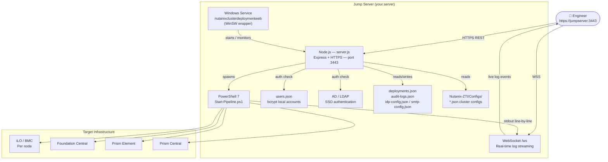
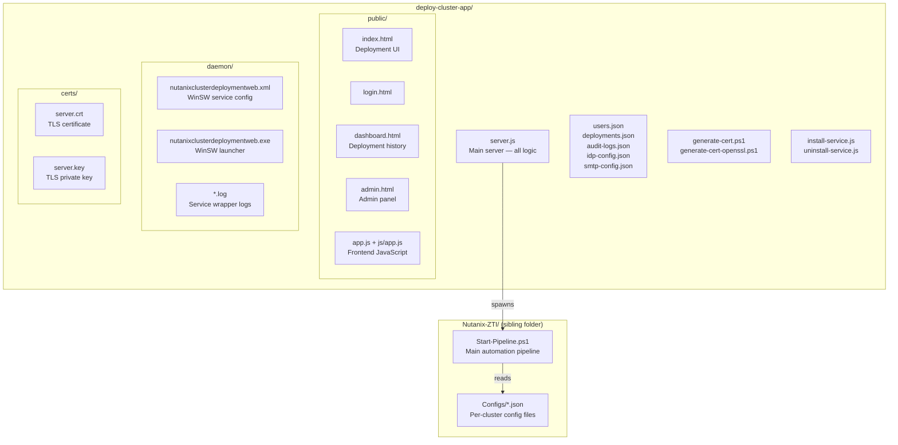

# Nutanix Cluster Deployment Manager

A secure, web-based portal for deploying and managing Nutanix clusters via Zero-Touch Infrastructure (ZTI). The application provides a rich configuration UI, real-time deployment progress via WebSocket, role-based access control, Active Directory integration, audit logging, and email notifications — all served over HTTPS.

---

## Table of Contents

- [Quick Start — First-Time Setup](#quick-start--first-time-setup)
- [Features](#features)
- [Architecture Overview](#architecture-overview)
- [Project Structure](#project-structure)
- [Prerequisites](#prerequisites)
- [Configuration](#configuration)
  - [Environment Variables](#environment-variables)
  - [Deployment Parameters](#deployment-parameters)
- [User Management](#user-management)
  - [Local Users](#local-users)
  - [Active Directory (AD/LDAP) Integration](#active-directory-adldap-integration)
- [SMTP / Email Notifications](#smtp--email-notifications)
- [Deployment Workflow](#deployment-workflow)
- [Dashboard & Audit Logs](#dashboard--audit-logs)
- [API Reference](#api-reference)
- [Security Notes](#security-notes)
- [License](#license)

---

## Quick Start — First-Time Setup

New to this tool? Follow these steps in order to get the portal running on a fresh Windows server.

> **Automated setup:** If you want to skip manual steps, run `start.ps1` from PowerShell as Administrator — it installs Node.js, PowerShell 7, npm packages, the SSL certificate, Posh-SSH, and the Windows service all in one go:
> ```powershell
> cd <path-to>\deploy-cluster-app
> .\start.ps1
> ```
> Manual steps are documented below for reference. Skip any step that is already done.

### Step 1 — Install Node.js

Open **PowerShell as Administrator** and run:

```powershell
winget install OpenJS.NodeJS.LTS
```

Close and reopen PowerShell after installation so `node` and `npm` are on your PATH.

> **Verify:** `node --version` should print `v18.x.x` or later.

### Step 2 — Install PowerShell 7

The deployment pipeline scripts require `pwsh.exe` (PowerShell 7):

```powershell
winget install Microsoft.PowerShell
```

Close and reopen PowerShell after installation.

> **Verify:** `pwsh --version` should print `PowerShell 7.x.x`.

### Step 3 — Install application dependencies

```powershell
cd <path-to>\deploy-cluster-app
npm install
```

This downloads all required packages into `node_modules\`.

### Step 4 — Create your configuration file

An annotated template is provided. Copy it to `.env` and fill in your values:

```powershell
Copy-Item .env.example .env
```

Then open `.env` and update at minimum:

| Variable | What to set |
|---|---|
| `COMPANY_NAME` | Your organisation name (shown in the UI) |
| `SESSION_SECRET` | A long random string (see below) |
| `SERVER_URL` | `https://<this-server-hostname>:3443` |

Generate a secure session secret with PowerShell:

```powershell
$b = New-Object byte[] 32; [System.Security.Cryptography.RNGCryptoServiceProvider]::new().GetBytes($b); [Convert]::ToBase64String($b)
```

All other fields (`PORT`, `SMTP_*`, `NODE_ENV`) are documented with comments inside `.env.example`.

> **SMTP note:** `SMTP_HOST`, `SMTP_PORT`, and `SMTP_USER` in `.env` are the SMTP settings used by pipeline result emails (`Send-PipelineEmail.ps1`). Welcome emails sent by the web app use the SMTP settings configured in **Admin → SMTP Settings** (stored in `smtp-config.json`). Both can point to the same relay — just configure them consistently.

> **Automated setup:** `start.ps1` creates `.env` automatically with a freshly generated session secret and the server hostname pre-filled. The `.env.example` file is still useful as a reference for all available fields.

### Step 5 — Add your company branding *(optional)*

Create the folder `public\images\` and place your files there:

| File | Purpose | Recommended size |
|------|---------|------------------|
| `public\images\logo.png` | Company logo in the nav bar | Max 220 × 80 px, transparent PNG |
| `public\images\login-bg.png` | Full-screen login page background | 1920 × 1080 px |

If no logo file is provided, the `COMPANY_NAME` text from `.env` is shown instead. No server restart needed after changing `COMPANY_NAME`.

### Step 6 — Generate an SSL certificate

```powershell
.\generate-cert.ps1
```

This creates `certs\server.key` and `certs\server.crt` using built-in Windows tools — no OpenSSL required.

### Step 7 — Install Posh-SSH

The deployment pipeline requires the `Posh-SSH` PowerShell module for SSH operations against CVMs and AHV hosts. Install it once into your PowerShell 7 session:

```powershell
pwsh -Command "Install-Module Posh-SSH -Scope CurrentUser -Force"
```

> **Note:** If you used `start.ps1`, this was already done automatically. Individual pipeline scripts (`Set-AHV-BondMode.ps1`, `Change-Prism-CVM-AHV-Password.ps1`) also auto-install Posh-SSH the first time they run, so this step is a belt-and-braces fallback.

### Step 8 — Install and start as a Windows Service

This registers the portal as a Windows service so it starts automatically on boot and restarts on failure.

```powershell
node install-service.js
```

Then start the service (installing alone does not start it):

```powershell
Start-Service 'Nutanix Cluster Deployment Web'
Get-Service  'Nutanix Cluster Deployment Web'
```

`Status` should show `Running`.

Open **`https://localhost:3443`** in your browser. Accept the browser warning for the self-signed certificate.
Log in with the default admin credentials:

| Field | Value |
|---|---|
| Username | `admin` |
| Password | `Changeme` |

> **Important:** Change the admin password via **Admin → User Management** after first login.

> **Tip:** For quick one-off testing without installing the service, run `node server.js` directly in a terminal — the server stops when you close the terminal.

#### Day-to-day service management

```powershell
# Stop the service
Stop-Service 'Nutanix Cluster Deployment Web'

# Restart (required after changes to server.js or files under public/)
Restart-Service 'Nutanix Cluster Deployment Web'

# Check status
Get-Service 'Nutanix Cluster Deployment Web'
```

Or manage via **Services** (`services.msc`) → *Nutanix Cluster Deployment Web*.

#### View service logs

```powershell
# Server output (startup messages, deployment logs)
Get-Content '<path-to>\deploy-cluster-app\daemon\nutanixclusterdeploymentweb.out.log' -Tail 100 -Wait

# Server errors
Get-Content '<path-to>\deploy-cluster-app\daemon\nutanixclusterdeploymentweb.err.log' -Tail 50

# WinSW wrapper (crash/restart events)
Get-Content '<path-to>\deploy-cluster-app\daemon\nutanixclusterdeploymentweb.wrapper.log' -Tail 30
```

#### Uninstall the service

```powershell
cd <path-to>\deploy-cluster-app
node uninstall-service.js
```

---

### Teardown / Re-testing (`delete.ps1`)

`delete.ps1` is the full reverse of `start.ps1`. Run it as Administrator to wipe the installation back to a clean slate so you can run `start.ps1` again. It will remove all dependencies and packages install, as part of deletion process:

```powershell
cd <path-to>\deploy-cluster-app
.\delete.ps1
```

What it removes (in order):

| Step | Action |
|------|--------|
| 1 | Stops and uninstalls the Windows service; deletes the WinSW launcher binary |
| 2 | Deletes `node_modules\` |
| 3 | Uninstalls the `Posh-SSH` PowerShell module |
| 4 | Uninstalls Node.js via winget |
| 5 | Uninstalls PowerShell 7 via winget |
| 6 | Deletes `.env` |
| 7 | Deletes `certs\` |
| 8 | Resets `deployments.json`, `audit-logs.json`, `last-deployment.json`, and `Nutanix-ZTI/historical-timings.json` to empty |

> **Warning:** `delete.ps1` is intended for test/lab environments only. It does **not** delete `users.json` or any `Nutanix-ZTI/Configs/` data.

---

## Features

- **HTTPS-only** web server (self-signed certificate, port `3443` by default)
- **Role-based access control** — `admin` and `user` roles
- **Local authentication** with bcrypt-hashed passwords
- **Active Directory / LDAP authentication** (LDAP / LDAPS, configurable)
- **Real-time deployment progress** via WebSocket
- **Dry-run mode** — validate a configuration without triggering an actual deployment
- **Save / load JSON configuration files** for reuse across deployments
- **16-step automated pipeline** — Phoenix boot through DNS record creation, fully orchestrated
- **Resume from any step** (`Start At Step`) and **skip individual steps** after partial failures
- **Dashboard** — deployment statistics, history, and audit log viewer
- **Audit logging** — every login, config change, and deployment is recorded
- **Automatic data retention** — records older than 30 days are purged daily
- **Welcome email** sent automatically when an AD user is imported
- **Dark / light theme toggle**
- **Windows Service support** via `node-windows`

---

## Architecture Overview



> The pipeline script `Start-Pipeline.ps1` and `Configs/` directory live in `<path-to>\Nutanix-ZTI\` alongside this app.

---

## Project Structure



**Flat file layout:**

```
deploy-cluster-app/
├── server.js               ← Main application entry point (all logic)
├── package.json
├── install-service.js      ← Run once to install Windows service
├── uninstall-service.js    ← Run once to remove Windows service
├── start.ps1               ← Automated one-shot setup (installs everything)
├── delete.ps1              ← Tear-down script (reverse of start.ps1, for re-testing)
├── .env                    ← Active configuration (generated by start.ps1 or copied from .env.example)
├── .env.example            ← Annotated template — copy to .env for manual setup
├── generate-cert.ps1       ← Generate self-signed TLS cert (no OpenSSL needed)
├── generate-cert-openssl.ps1  ← Convert PFX → PEM using OpenSSL
├── users.json              ← Local user accounts (bcrypt hashed passwords)
├── deployments.json        ← Deployment history (auto-created)
├── audit-logs.json         ← Audit trail (auto-created)
├── idp-config.json         ← AD/LDAP configuration
├── smtp-config.json        ← SMTP settings for web app welcome emails (Admin → SMTP Settings)
├── last-deployment.json    ← Last deployment state
├── certs/
│   ├── server.key          ← TLS private key (generated)
│   └── server.crt          ← TLS certificate (generated)
├── daemon/
│   ├── nutanixclusterdeploymentweb.exe       ← WinSW binary
│   ├── nutanixclusterdeploymentweb.xml       ← Service descriptor
│   └── *.log               ← Service wrapper logs (stdout/stderr/wrapper)
└── public/
    ├── index.html          ← Main deployment configuration page
    ├── login.html          ← Login page
    ├── dashboard.html      ← Deployment dashboard & audit log
    ├── admin.html          ← User management & settings (admin only)
    ├── app.js              ← Frontend JavaScript
    ├── js/app.js
    ├── css/styles.css
    └── images/             ← ⬅ Place your custom branding images here
        ├── logo.png        ← Company logo (shown in header & login page)
        └── login-bg.png    ← Login page background image
```

---

## Branding / Custom Images

The application supports custom company branding with **no code changes required**.  
You can set the company name in the `.env` file, upload image files, or both.

### Option A — Company name text (`.env` file)

Set the `COMPANY_NAME` variable in your `.env` file:

```env
COMPANY_NAME=Acme Corporation
```

This name is served via `/api/branding` and applied automatically to:
- The **browser tab title** on every page
- The **nav bar** and **login panel** fallback label (shown when no `logo.png` is found)

### Option B — Image files

Drop files into `public/images/` — the server serves them automatically.

| File | Path | Purpose | Recommended size |
|------|------|---------|-----------------|
| `logo.png` | `public/images/logo.png` | Company logo in the top-left nav bar and on the login page | Max 220 × 80 px, transparent PNG |
| `login-bg.png` | `public/images/login-bg.png` | Full-screen background of the login page | 1920 × 1080 px, PNG or JPEG |

### How the fallbacks work

- If **`logo.png`** is present → displayed in the nav bar and on the login panel.  
  If missing → falls back to the `COMPANY_NAME` text from `.env` (no error shown to users).
- If **`login-bg.png`** is present → used as the login page background.  
  If missing → the page falls back to a solid sky-blue background.

### Steps to add your branding

1. Open `.env` and set `COMPANY_NAME=Your Actual Company`.
2. Create (or navigate to) `deploy-cluster-app/public/images/`.
3. Copy your **company logo** as `logo.png` into that folder.
4. Copy your **background image** as `login-bg.png` into that folder.
5. Restart the server — branding takes effect immediately.

> **Tip:** Use a PNG with transparency for the logo so it looks clean on both light and dark nav bars.

---


## Prerequisites

| Requirement | Version | Notes |
|---|---|---|
| **Node.js** | 18+ | `node` and `npm` must be on `PATH` |
| **PowerShell** | 7+ (`pwsh.exe`) | Used to execute the deployment pipeline |
| **Active Directory** | — | Only required when LDAP/AD authentication is used |

### npm package dependencies

Installed automatically by `npm install`:

| Package | Version | Purpose |
|---|---|---|
| `express` | ^4.17 | HTTP/HTTPS server and routing |
| `express-session` | ^1.19 | Session management (cookie-based auth) |
| `bcryptjs` | ^3.0 | Password hashing for local user accounts |
| `ws` | ^8.19 | WebSocket server — real-time pipeline log streaming |
| `ldapjs` | ^3.0 | LDAP/AD authentication and user search |
| `nodemailer` | ^8.0 | Email notifications (welcome emails, deployment alerts) |
| `node-windows` | ^1.0 | Windows service install/uninstall helper |
| `dotenv` | ^17.3 | Optional `.env` file support for environment overrides |

### PowerShell module dependencies

| Module | How it's installed | Used by |
|---|---|---|
| `Posh-SSH` | Installed automatically by `start.ps1` (Step 7) **or** on first use by `Set-AHV-BondMode.ps1` / `Change-Prism-CVM-AHV-Password.ps1`. Can also be installed manually — see Quick Start Step 7. | CVM SSH operations (password change, bond mode) |

---

## Configuration

### Environment Variables

Create a `.env` file in the application root to override defaults:

| Variable | Default | Description |
|---|---|---|
| `PORT` | `3443` | HTTPS port |
| `SMTP_HOST` | *(blank)* | SMTP relay hostname — used by pipeline result emails. Leave blank to skip pipeline emails. |
| `SMTP_PORT` | `25` | SMTP port (`25` = plain relay, `587` = STARTTLS) |
| `SMTP_USER` | `noreply@company.com` | Sender `From:` address |
| `SERVER_URL` | `https://localhost:3443` | Portal URL included in welcome emails |

> **Web app welcome emails** use the SMTP settings configured separately via **Admin → SMTP Settings** in the UI (stored in `smtp-config.json`). AD settings are also managed via the UI.

### Deployment Parameters

Cluster configurations are stored as JSON files in `<path-to>\Nutanix-ZTI\Configs\`. Each configuration file captures:

| Section | Key Fields |
|---|---|
| **Basic** | Cluster name, hypervisor (`AHV` / `ESXi`), storage container, timezone |
| **Network** | IP prefix, subnet mask, gateway, subnet name, cluster VIP, IP pool range |
| **Nodes** | Per-node IPMI IP, hypervisor IP, CVM IP, node serial (1–16 nodes supported) |
| **Foundation Central** | URL, username, password |
| **DNS & NTP** | Up to 3 DNS servers, up to 2 NTP servers |
| **DNS Admin** | `domain`, `username`, `password` — service account used by Step 16 to create DNS A records via RPC. **Step 16 is auto-skipped if `username` or `password` are absent.** |
| **Witness** | Witness IP, username, password (optional) |
| **AOS** | AOS version, AOS package URL, hypervisor ISO URL |
| **CyberArk** | Tenant URL, tenant ID, service account, password, vault folder — Step 15 auto-skipped if absent |
| **Notify** | `notify.to` (recipient email) and `notify.cc` (comma-separated CC list) — a pipeline result email is sent when deployment finishes. Leave both empty to skip email notifications. |

Configurations can be saved, loaded, and previewed in YAML, JSON, or ENV format directly from the browser.

---

## User Management

### Local Users

Managed via **Admin → User Management**. Passwords are hashed with bcrypt (minimum 6 characters). The built-in `admin` account cannot be deleted.

### Active Directory (AD/LDAP) Integration

Configured via **Admin → User Management → Identity Provider** tab:

| Field | Description |
|---|---|
| **LDAP Server** | Hostname or IP of the domain controller |
| **Port** | `389` (LDAP) or `636` (LDAPS) |
| **Use SSL** | Automatically enabled for port 636 |
| **Bind DN** | Service account DN for directory searches |
| **Bind Password** | Service account password |
| **Base DN** | Search root (e.g., `DC=company,DC=net`) |
| **User Search Filter** | Default: `(sAMAccountName={{username}})` |
| **Display Name Attribute** | Default: `displayName` |
| **Email Attribute** | Default: `mail` |
| **Default Role** | Role assigned when importing users (`user` or `admin`) |

**Flow:**
1. Admin searches for AD users by username, display name, or email.
2. Admin imports the user with an assigned role.
3. Imported user logs in using their Active Directory credentials.
4. AD users' passwords are **never stored locally** — authentication always goes back to AD.

> Domain prefixes (`domain\username` or `domain/username`) are automatically stripped at login.

---

## SMTP / Email Notifications

There are two distinct email paths — each with its own SMTP configuration:

### 1. Pipeline result emails (`Send-PipelineEmail.ps1`)

A pipeline result email is sent at the end of every deployment (success or failure). SMTP settings are read from `.env`:

| `.env` variable | Description |
|---|---|
| `SMTP_HOST` | Relay hostname — leave blank to disable pipeline emails |
| `SMTP_PORT` | Port (`25` plain, `587` STARTTLS) |
| `SMTP_USER` | Sender `From:` address |

The **recipient** is set per cluster in the cluster config JSON, not in `.env`. Use the **Notify** tab in the deployment form:

| Config field | Description |
|---|---|
| `notify.to` | Primary recipient email address |
| `notify.cc` | Comma-separated CC list (optional) |

Leave both `notify.to` and `notify.cc` empty in a cluster config to skip email for that deployment. Set `SMTP_HOST` to blank in `.env` to disable pipeline emails globally.

### 2. Welcome emails (web app / `server.js`)

When an AD/LDAP user is imported, a welcome email is sent containing their portal access link, username, and role.

SMTP for welcome emails is configured via **Admin → SMTP Settings** in the web UI (stored in `smtp-config.json`):

| Field | Description |
|---|---|
| **SMTP Server** | Hostname or IP of your mail relay |
| **SMTP Port** | `25` (plain), `587` (STARTTLS) |
| **Sender Email** | `From:` address |
| **Portal URL** | Included as a link in the email body |

Use the **Test SMTP Connection** button in the UI to verify before going live.

No username/password authentication is used — both paths are designed for internal unauthenticated SMTP relays.

---

## Pipeline Steps

When a deployment starts, `Start-Pipeline.ps1` runs up to 16 sequential steps:

```mermaid
flowchart LR
    S1["1\nPhoenix Boot\niLO → mount ISO,\nreboot nodes"]
    S2["2\nPhoenix Boot\nCheck\nwait for Phoenix OS"]
    S3["3\nNode Discovery\nFoundation Central\ndiscovers nodes"]
    S4["4\nImage & Create Cluster\nFC images AHV+AOS,\ncreates cluster"]
    S5["5\nAccept EULA\nPrism Element"]
    S6["6\nRegister to\nWitness"]
    S7["7\nRegister to\nPrism Central"]
    S8["8\nCreate VLANs"]
    S9["9\nCreate Storage\nContainer"]
    S10["10\nBackup Policies"]
    S11["11\nProtection\nPolicy"]
    S12["12\nRecovery Plan"]
    S13["13\nAHV Bond\nMode"]
    S14["14\nChange Passwords\n→ CSV"]
    S15["15\nImport to\nCyberArk"]
    S16["16\nAdd DNS Records\nnodes + VIP\nA records"]

    S1-->S2-->S3-->S4-->S5-->S6-->S7-->S8-->S9-->S10-->S11-->S12-->S13-->S14-->S15-->S16
```



Each step writes real-time output to the browser via WebSocket. A step failure stops the pipeline and can be resumed at any step number using **Start At Step**.

> Step 15 (CyberArk) is auto-skipped when the `cyberark` section is absent from the config.  
> Step 16 (DNS Records) requires the `dns_admin` section in the config with valid service account credentials.

---

## Deployment Workflow

1. **Load or build a configuration** on the main page (`/`).
2. *(Optional)* **Save Configuration** to persist it as a named JSON file.
3. Choose an action:
   - **Start Deployment** — runs `Start-Pipeline.ps1 -ConfigFile <path>` via PowerShell 7.
   - **Dry Run** — runs `Start-Pipeline.ps1 -ConfigFile <path> -dryrun` without making changes.
4. **Real-time progress** is streamed to the browser via WebSocket. The UI shows step-by-step status for:
   - Configuration validation
   - Foundation Central connection
   - Node imaging
   - Cluster creation
   - Network configuration
   - Witness registration
5. On completion, the deployment record (duration, exit code, success/failure) is saved and appears in the Dashboard.

> Only one deployment can run at a time. A subsequent request will be rejected with HTTP 400 until the active one finishes.

---

## Dashboard & Audit Logs

Available at `/dashboard.html` for all authenticated users.

**Statistics cards:**
- Total deployments (last 30 days)
- Dry-run count
- Production count
- Successful / failed counts

**Deployment history table** — timestamp, cluster name, user, duration, dry-run flag, and result.

**Audit log table** — every significant action is recorded:

| Action | Trigger |
|---|---|
| `login` / `logout` | User session |
| `user_created` / `user_deleted` | Admin user management |
| `password_changed` | Admin password reset |
| `ad_user_imported` | AD user import |
| `idp_config_updated` / `idp_test_connection` | Identity Provider settings |
| `smtp_config_updated` / `smtp_test_sent` | SMTP settings |
| `config_loaded` / `config_saved` | Configuration file actions |
| `deployment_started` / `deployment_completed` | Deployment lifecycle |

All records older than **30 days** are automatically purged at midnight each day.

---

## API Reference

All API endpoints (except login) require a valid session cookie.

| Method | Path | Auth | Description |
|---|---|---|---|
| `POST` | `/api/login` | Public | Log in (local or AD) |
| `POST` | `/api/logout` | User | Destroy session |
| `GET` | `/api/current-user` | User | Get logged-in user info |
| `GET` | `/api/users` | Admin | List all users |
| `POST` | `/api/users` | Admin | Create local user |
| `DELETE` | `/api/users/:id` | Admin | Delete user |
| `PUT` | `/api/users/:id/password` | Admin | Reset local user password |
| `GET` | `/api/idp/config` | Admin | Get IdP configuration |
| `POST` | `/api/idp/config` | Admin | Save IdP configuration |
| `POST` | `/api/idp/test` | Admin | Test LDAP connection |
| `GET` | `/api/idp/search-users?q=` | Admin | Search AD users |
| `POST` | `/api/idp/import-user` | Admin | Import AD user |
| `GET` | `/api/smtp/config` | Admin | Get SMTP configuration |
| `POST` | `/api/smtp/config` | Admin | Save SMTP configuration |
| `POST` | `/api/smtp/test` | Admin | Send test email |
| `GET` | `/api/configs` | User | List saved configuration files |
| `GET` | `/api/config/:filename` | User | Load a configuration file |
| `POST` | `/api/config/:filename` | User | Save a configuration file |
| `POST` | `/api/deploy` | User | Start a deployment |
| `GET` | `/api/deploy/status` | User | Get current deployment status |
| `GET` | `/api/dashboard/statistics` | User | Get deployment statistics |
| `GET` | `/api/dashboard/deployments` | User | Get deployment history |
| `GET` | `/api/dashboard/audit-logs` | User | Get audit logs |

WebSocket endpoint: `wss://<host>:3443` — streams `log`, `step_update`, `deployment_started`, `deployment_completed`, and `deployment_error` events.

---

## Security Notes

- All traffic is encrypted via **HTTPS/TLS**; HTTP is not served.
- Sessions use `httpOnly`, `secure` cookies with a 24-hour lifetime.
- Passwords are stored as **bcrypt** hashes (cost factor 10).
- AD bind passwords are **never returned to the browser** (masked as `********`).
- LDAP connections use `rejectUnauthorized: false` to accommodate internal CAs — consider enabling strict validation in production.
- The self-signed certificate is valid for 5 years; replace with a CA-signed certificate for production use.
- A daily cleanup job automatically removes deployment records and audit logs older than 30 days.

---

## License

This project is licensed under the ISC License.